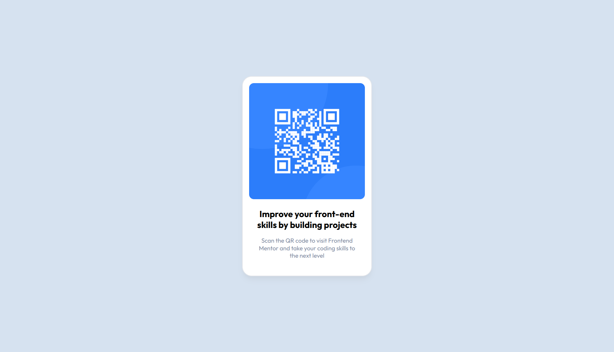
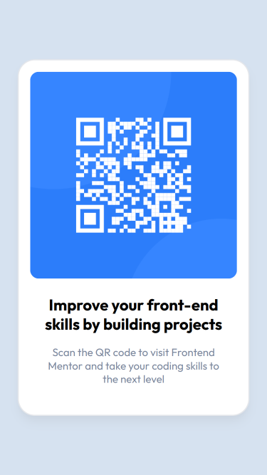

# Frontend Mentor - QR code component solution

This is a solution to the [QR code component challenge on Frontend Mentor](https://www.frontendmentor.io/challenges/qr-code-component-iux_sIO_H). Frontend Mentor challenges help you improve your coding skills by building realistic projects.

## Table of contents

-   [Overview](#overview)
    -   [Screenshot](#screenshot)
    -   [Links](#links)
-   [My process](#my-process)
    -   [Built with](#built-with)
    -   [What I learned](#what-i-learned)
    -   [Continued development](#continued-development)
    -   [Useful resources](#useful-resources)
-   [Author](#author)
-   [Acknowledgments](#acknowledgments)

**Note: Delete this note and update the table of contents based on what sections you keep.**

## Overview

### Screenshot

 

### Links

-   Solution URL: [Add solution URL here](https://your-solution-url.com)
-   Live Site URL: [Add live site URL here](https://your-live-site-url.com)

## My process

### Built with

-   Semantic HTML5 markup
-   Flexbox
-   Mobile-first workflow
-   [Astro](https://astro.build/) - JS library
-   [Tailwind CSS](https://tailwindcss.com/) - CSS Utility Lirary

### What I learned

This was the first time I used Astro and Tailwind CSS in a project. By themselves, they are both excellent tools. Together, they make things so easy.

#### Astro
I have only briefly heard of Astro through podcasts and YouTube, and it's not all how I imagined it: "...yet another framework to learn." 
I honestly never gave it a chance. Once I dove in to the documentation and started using it, boy am I amazed at how elegant it is. One of the things
I struggle with using JavaScript frameworks is configuration, setup, and managing the quirks. Astro makes this so simple - it just works! It's a breath of fresh air.
This will definitely be my go to for static websites now.

#### Tailwind CSS
Tailwind makes working with CSS really easy. I've been learning about it for a long time and am
so excited to be finally using it. The developer experience and how quick it is to try different styles.

#### QR Code Solution

As a whole, this was a rewarding project. It greatly enhanced my confidence in my front-end development skills and
calmed a fear I had about not being able to apply my knowledge. Despite this being an introductory challenge, 
I'm extremely excited to take on the next one.

## Author

-   Patrick Nolen
-   Frontend Mentor - [@Xerullian](https://www.frontendmentor.io/profile/Xerullian)